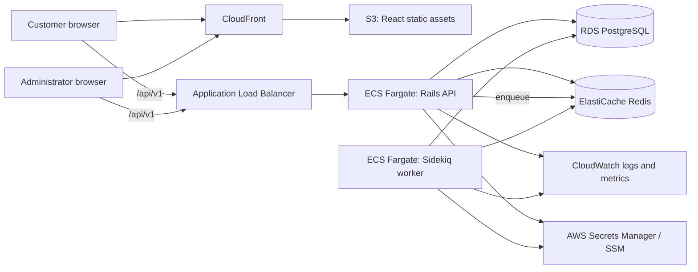
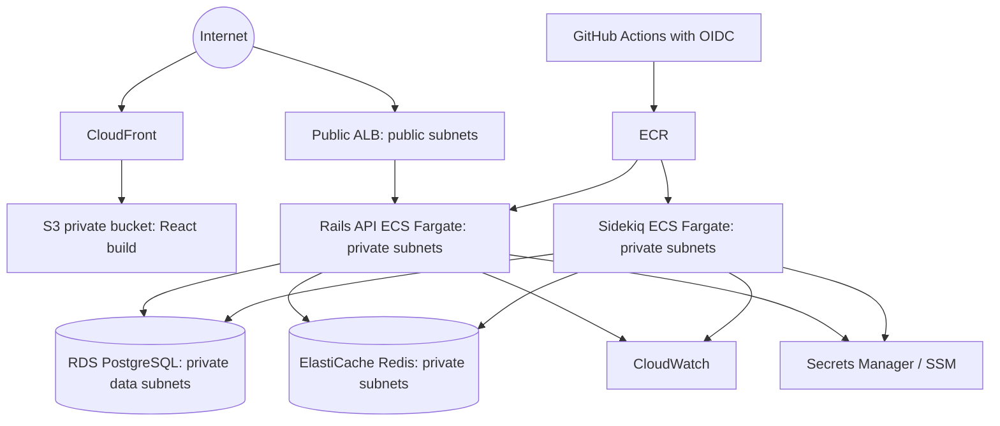

# ShopSphere architecture

## 1. Business requirements and scope

### Core customer journeys

1. A customer registers, authenticates, refreshes a session, and manages a profile and addresses.
2. A customer browses a catalogue, searches and filters products, views product detail, and manages a wishlist.
3. A customer maintains one active cart, applies an eligible coupon, and sees an authoritative price breakdown.
4. A customer checks out once per idempotency key, receives an order outcome, and can view or cancel eligible orders.
5. A customer leaves a review only when the eventual policy permits it, for example following a fulfilled purchase.

### Core administrator journeys

1. An administrator manages categories, products, images, product lifecycle state, and inventory.
2. An administrator processes orders, manages coupons, and investigates payment outcomes.
3. An administrator views sales and low-stock operational data.

### Critical non-functional requirements

- Correctness takes precedence over throughput during inventory reservation and checkout.
- APIs use consistent JSON errors, pagination, filtering, and versioning.
- Authentication and authorization are enforced on the server for every protected action.
- The application is observable through health checks, structured logs, metrics/alerts, and background-job failure visibility.
- Deployments are repeatable through containers, Terraform, and CI/CD.

### Explicit first-release boundaries

The project is a single merchant storefront with a mock payment provider. Multi-merchant support, real payment processing, international taxation, multi-currency, and event-streaming infrastructure are deferred. Those are meaningful product expansions, not missing CRUD endpoints.

## 2. System context



CloudFront serves immutable frontend assets. Browser API requests target the ALB directly in the initial deployment topology; this avoids unintentionally turning CloudFront into an API cache before API cache policy, authentication, and invalidation semantics are explicitly designed. A later decision can place selected public catalogue reads behind CloudFront.

## 3. Rails API architecture

### Interface and versioning

Rails runs in API-only mode and owns the canonical business API under `/api/v1`. REST is chosen because the domain is resource- and workflow-oriented, browser tooling is excellent, and it makes HTTP semantics, caching, observability, and OpenAPI documentation straightforward. GraphQL would be defensible for highly composable client data needs, but it expands authorization, query-cost, caching, and operational complexity without a present requirement.

The API will use:

- resource-oriented routes with explicit workflow endpoints only where a resource route obscures intent, such as checkout;
- stable JSON response and error envelopes;
- cursor or page-based pagination selected and documented before catalogue endpoints ship;
- an `Idempotency-Key` header for checkout and other financially consequential writes;
- explicit API version namespaces, so a breaking change has a migration path.

### Internal boundaries

```text
Request
  -> API::V1 controller (HTTP parsing, authentication, authorization, response)
  -> form/parameter validation where request-specific validation is useful
  -> service object (a multi-step business workflow)
  -> Active Record models and PostgreSQL transaction
  -> serializer/representer (response shape)

Read request
  -> API::V1 controller
  -> query object (complex search, filtering, reporting)
  -> relation with explicit eager loading and pagination
  -> serializer/representer
```

Controllers stay thin: they do not calculate totals, mutate inventory, or assemble complex SQL. Models own local invariants, associations, and simple domain behavior. Services appear only for transactional or externally visible workflows such as checkout, payment processing, cancellation, and inventory adjustment. Query objects are reserved for composable or performance-sensitive reads such as product search and sales reports.

This avoids both extremes: fat controllers hide business rules in HTTP code, while a service object for every `create` action creates indirection without a business benefit.

### Security boundary

- Passwords use Rails secure password storage; password material never appears in API responses or logs.
- JWT access tokens are short-lived. Refresh tokens are persisted/revocable and stored only as a secure digest, enabling logout and compromise response.
- Pundit is invoked at the Rails boundary for every protected action. React route guards are usability features, not authorization.
- Rack::Attack, CORS allowlists, secure headers, strong parameters, OpenAPI request contracts, RuboCop, and Brakeman form layered controls.

## 4. React architecture

React with TypeScript and Vite is a separately deployable SPA. It is deliberately a consumer of the Rails contract rather than a second implementation of business rules.

```text
src/
  app/           application composition, providers, routing
  components/    reusable presentational UI
  features/      product, cart, auth, order, admin feature modules
  pages/         route-level composition
  services/      Axios client and API endpoint adapters
  hooks/         reusable UI/data hooks
  types/         API/domain types
  utils/         pure cross-cutting utilities
```

- React Router owns navigation and route-level protection for user experience.
- TanStack Query owns server-state fetching, caching, invalidation, retries, and loading/error states.
- React Hook Form plus Zod owns client-side form ergonomics and immediate feedback.
- Axios centralizes base URL configuration, authorization headers, token refresh coordination, and normalized API errors.
- Feature modules own their components, hooks, and API adapters as the application grows; a single global `components/` folder is kept for genuinely shared primitives only.

The SPA may optimistically update low-risk UI state, such as a wishlist indicator, but must reconcile with the API response. It must not calculate authoritative checkout totals, decide inventory availability, or grant administrative access.

## 5. Data and asynchronous responsibilities

| Component | Owns | Must not own |
|---|---|---|
| PostgreSQL | Users, products, inventory, carts, orders, payments, coupons, addresses, reviews; foreign keys, constraints, indexes, transactions | Cache entries, job execution state, ephemeral rate-limit counters |
| Redis | Rails cache, Sidekiq queues/retry metadata, short-lived coordination, Rack::Attack counters | Durable orders, payment truth, sole inventory record, irreplaceable jobs without a durable source |
| Sidekiq | Retriable asynchronous execution: notifications, reports, cleanup, integrations | Synchronous checkout correctness or a replacement for database transactions |

### Checkout correctness model

Checkout is a PostgreSQL transaction. It will lock the relevant inventory rows in a deterministic order, revalidate prices/coupon/inventory server-side, write an idempotency record and order/items/payment state, decrement/reserve stock, and clear the cart only after successful persistence. Jobs are enqueued after the transaction commits—ideally via a transactional outbox or a similarly durable handoff—so an order confirmation is not emitted for a rolled-back order.

Row locking constrains concurrent purchases of the last item. It is intentionally more conservative than eventually consistent cache-based stock tracking because overselling is a business-integrity failure. The trade-off is lock contention on popular products; we will measure it, set clear retry/error behavior, and avoid holding locks during payment-network calls.

## 6. AWS target architecture



### Network and trust boundaries

- A VPC spans at least two Availability Zones.
- The ALB is public. ECS tasks run in private subnets and accept API traffic only from the ALB security group.
- RDS and ElastiCache run in private data subnets and accept traffic only from the API/worker security groups as appropriate. Neither has public IP exposure.
- S3 blocks public access; CloudFront accesses it through Origin Access Control.
- GitHub Actions authenticates to AWS through short-lived OIDC credentials, not stored access keys.
- ECS task roles provide least-privilege access to logs and runtime secrets; deployment permissions belong to CI, not the application task.

### Availability and operational trade-offs

ECS Fargate avoids Kubernetes control-plane overhead while still demonstrating container orchestration, health checks, autoscaling, task roles, and a separate worker process. RDS Multi-AZ, backups, encryption, CloudWatch alarms, and controlled migrations provide a production-credible baseline. This is not a claim of active-active regional resilience; that would be disproportionate for the portfolio scope and needs explicit recovery objectives.

## 7. Planned repository boundaries

```text
backend/                 Rails API source, tests, database migrations, containers
frontend/                React TypeScript SPA source and build configuration
terraform/modules/       Reusable AWS resource modules
terraform/environments/  Environment-specific composition and safe examples
docs/                    Architecture and evolving technical documentation
.github/workflows/       Continuous integration and deployment definitions
```

Empty directories are intentionally represented by `.gitkeep` files today. Application scaffolding begins only on later scheduled days.

## 8. Decisions to validate as implementation starts

1. ~~Choose JWT refresh-token transport and CSRF posture.~~ **Resolved on Day 5** — HttpOnly cookie with `SameSite=Lax` plus an `Origin` allowlist. See [ADR-008](DECISIONS.md).
2. ~~Choose pagination semantics.~~ **Resolved on Day 7** — offset pagination with a capped page size and a unique tiebreaker in every ordering, with cursor pagination reserved for machine consumers. See [ADR-011](DECISIONS.md).
3. Choose an outbox implementation before Sidekiq notifications are introduced, so committed orders reliably drive external effects. **Still open; due before Day 16.**
4. Set concrete recovery objectives, instance classes, and scaling thresholds when AWS cost constraints are known. **Still open; due before Day 27.**

## 9. Verified facts, as distinct from intent

Everything above describes a target architecture. What has actually been built and checked:

| Claim | Status |
|---|---|
| Rails API boots in production mode in a container | **Verified** Day 7 — `GET /api/v1/health` returns `{"data":{"status":"ok"}}` |
| Readiness check covers PostgreSQL and Redis | **Verified** — fails closed, and names no dependency in the response |
| Schema enforces correctness independently of Rails | **Verified** — 17 specs drive invalid data through raw SQL |
| Authentication cannot be forgotten on an endpoint | **Verified** — required by default; opting out is explicit |
| Authorization cannot be forgotten in an action | **Verified** — `verify_authorized` raises; a spec keeps it armed |
| Catalogue and order reads are N+1 free | **Verified** — query count flat across dataset sizes |
| CI pipeline passes | **Unverified** — the workflow has never been observed running |
| Sidekiq, Redis caching, Terraform, ECS | **Not built** |

The CI row matters: the pipeline was inert until Day 2's remediation, and no run has been observed since.
