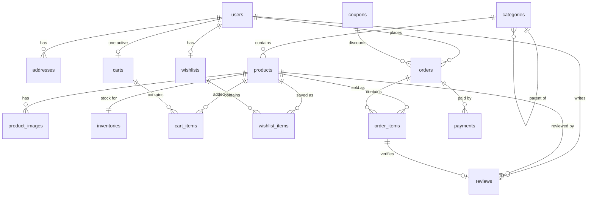

# ShopSphere database design

PostgreSQL 16. Schema introduced on Day 3; Active Record models follow on Day 4.

## 1. Governing principle

**Correctness is enforced by the database, not by Active Record.**

Rails validations are a user-experience feature: they produce good error messages for well-behaved requests. They are not a guarantee. `update_all`, `insert_all`, `upsert`, raw SQL, a Sidekiq job, an admin bulk edit, and a console session all bypass them. Anything whose violation would corrupt money, stock, or identity is therefore expressed as a `NOT NULL`, `CHECK`, `UNIQUE`, or foreign key constraint.

The corollary matters as much: constraints are enforced at write time against *all* writers, so a constraint that is wrong blocks legitimate work. Each one below exists because its violation is a business failure, not merely untidy data.

## 2. Entity relationships



## 3. Representation decisions

### Money — `numeric(12,2)`

PostgreSQL `numeric` is exact decimal arithmetic, not binary floating point, and Active Record maps it to `BigDecimal`. Values stay exact from database to Ruby and back.

The alternative is integer minor units (`price_cents bigint`), which is what payment processors use. It was rejected for this release because ShopSphere is single-currency, and minor units add a conversion at every boundary for a correctness benefit `numeric` already provides.

The condition that would change the decision is multi-currency. Minor-unit exponents differ per currency — JPY has none, KWD has three — so a hardcoded scale of 2 becomes wrong the moment a second currency appears.

**Rule this imposes on the API layer:** money must serialize to JSON as a **string**, never a number. JavaScript's `number` is IEEE-754 double, so `102.50` transmitted as a JSON number can be read back imprecisely. This is enforced in serializers, from Day 8 onward.

### Status columns — `varchar` + `CHECK`, not native enums

A PostgreSQL `ENUM` type gives the same integrity but is expensive to evolve: `ALTER TYPE ... ADD VALUE` carries transaction restrictions, and a value can never be removed. A `CHECK` constraint can be dropped and recreated inside an ordinary transactional migration.

For a schema this young, cheap evolution outweighs the few bytes an enum saves. The integrity guarantee is identical: `INSERT INTO users (role) VALUES ('superadmin')` is rejected either way.

### Roles — a column, not a table

`users.role` holds `customer` or `admin`. A `roles` table plus a join table models a two-value set with an extra join on every authorization check, which conflicts with the project's rule against unnecessary abstractions.

The condition that would change the decision is genuine RBAC: multiple simultaneous roles per user, or granular permissions an administrator edits at runtime. That is a `roles` + `user_roles` migration, taken when the requirement is real.

### Order addresses — snapshots, not foreign keys

`orders.shipping_address` and `orders.billing_address` are `jsonb` copies taken at checkout, not references to `addresses`.

Addresses are mutable. An order is a permanent record of where goods were actually sent. Linking would let a profile edit in 2027 silently rewrite a 2026 invoice. This is the same reasoning that snapshots `product_name`, `product_sku`, and `unit_price` onto `order_items`: **a historical record must not change when the catalogue does.**

## 4. Concurrency and inventory

Stock lives in its own `inventories` table, one row per product, rather than as a `products.stock` column.

Checkout will take an exclusive row lock (`SELECT ... FOR UPDATE`) on the inventory rows for the basket, in `product_id` order, validate the whole basket under that lock, then decrement. Two consequences drove the separate table:

1. **Lock scope.** If stock were a column on `products`, `FOR UPDATE` would lock the entire product row, so an administrator editing a description would block checkout, and checkout would block catalogue writes. A separate table confines the lock to the contended quantity.
2. **Write amplification.** A purchase rewrites a narrow `inventories` row instead of a wide `products` row, producing smaller row versions and less vacuum pressure on the catalogue's hot read path.

Deterministic lock ordering (`ORDER BY product_id`) prevents deadlock: two baskets containing the same two products in opposite order would otherwise each hold one lock and wait for the other.

### The backstop

```sql
CHECK (available_quantity >= 0)
```

Row locking is the *mechanism* that prevents overselling, and it lives in application code that a future contributor can forget. This constraint is the *guarantee*: any statement that would drive stock below zero raises instead of succeeding quietly, regardless of which code path issued it.

Mechanisms get forgotten. Constraints do not. `spec/database/schema_constraints_spec.rb` asserts exactly this by decrementing stock below zero through raw SQL and expecting a failure.

Full analysis of the three approaches considered — pessimistic locking, atomic conditional update, and two-phase reservation — belongs in `docs/DECISIONS.md`.

## 5. Index catalogue

Every index is a read optimisation paid for with write cost: each `INSERT`, and each `UPDATE` touching an indexed column, must also update the index. Partial indexes (`WHERE ...`) are used wherever the hot query only ever touches a subset, because they shrink both the storage and the write cost to that subset.

| Index | Query it serves | Why it is needed | Write / storage cost |
|---|---|---|---|
| `users (email)` UNIQUE | Login lookup by email | Runs on every authentication. Unique because duplicate emails make "which account authenticated?" ambiguous — a security problem, not just a data one | One entry per user; users are rarely written |
| `products (status, published_at DESC) WHERE status='active'` | Catalogue listing: filter active, sort newest | Runs on nearly every page view. Composite satisfies filter *and* sort from one index scan, with no sort step | Only active rows indexed; publishing/archiving rewrites one entry |
| `products (category_id, status)` | Browse and admin filter by category | Avoids a sequential scan as the catalogue grows | Small; products change infrequently |
| `products (slug)` UNIQUE, `products (sku)` UNIQUE | URL resolution; SKU lookup | Slug resolves on every product page; unique keeps routes unambiguous | Negligible |
| `inventories (product_id)` UNIQUE | Lock and read stock during checkout | On the checkout hot path. Unique enforces the one-row-per-product invariant | Narrow table, but the most write-heavy index in the schema |
| `inventories (available_quantity)` | Admin low-stock dashboard | Supports `available_quantity <= reorder_threshold`. A partial index cannot be used because the predicate compares two columns | Updated on every purchase; kept single-column to limit that cost |
| `orders (user_id, created_at DESC)` | "My orders", newest first | The most frequent authenticated read. Composite serves filter and sort together | Replaces a plain `user_id` index rather than adding to it |
| `orders (status, created_at)` | Admin order queue, oldest first | Avoids scanning all orders to find pending ones | One entry per order; status changes rewrite it |
| `orders (idempotency_key)` UNIQUE | Duplicate checkout detection | Makes "one order per checkout attempt" a database guarantee, not a race between two retries | Negligible |
| `orders (number)` UNIQUE | Customer-facing order lookup | Support and customers reference orders by number | Negligible |
| `order_items (order_id, product_id)` UNIQUE | Order detail page; one line per product | Also serves `order_id` alone from its leading column, so no separate `order_id` index exists | One entry per line |
| `order_items (product_id)` | Sales reporting aggregated by product | Reports would otherwise scan all line items | One entry per line |
| `payments (idempotency_key)` UNIQUE | Payment retry safety | Prevents charging twice for one attempt | Negligible |
| `payments (provider_reference) WHERE NOT NULL` UNIQUE | Provider webhook reconciliation | A callback delivered twice must not record two payments. Partial because the reference arrives after creation | Only populated rows indexed |
| `carts (user_id) WHERE status='active'` UNIQUE | Load the current cart | Closes a real race: two concurrent "add to cart" requests each finding no cart would create two, splitting the basket. Partial so converted carts remain as history | Tiny — one entry per active cart |
| `cart_items (cart_id, product_id)` UNIQUE | Cart contents; increment-on-re-add | Makes "one line per product" enforced rather than conventional | One entry per line |
| `addresses (user_id, kind) WHERE is_default` UNIQUE | "Default shipping address for this user" | Makes at-most-one-default a guarantee against two concurrent profile updates both reading false and writing true | Only default rows indexed |
| `product_images (product_id) WHERE is_primary` UNIQUE | Listing thumbnail | Exactly one primary image, safe against concurrent admin edits | Only primaries indexed |
| `reviews (product_id, created_at DESC) WHERE status='approved'` | Product page reviews, newest first | Also backs the rating aggregate. Partial because pending and rejected reviews are never shown publicly | Only approved rows; moderation rewrites one entry |
| `reviews (user_id, product_id)` UNIQUE | One review per customer per product | Prevents double submission and deliberate rating inflation | Negligible |
| `coupons (code)` UNIQUE | Coupon redemption by typed code | `citext` makes `SAVE20` and `save20` the same coupon | Negligible |

**Redundant indexes deliberately removed.** `t.references` creates a single-column index by default. Where a composite index already leads with that column — `order_items.order_id`, `orders.user_id`, `cart_items.cart_id`, `wishlist_items.wishlist_id`, `products.category_id`, `product_images.product_id`, `reviews.user_id` — the automatic index was suppressed with `index: false`. A redundant index costs a write on every insert and serves no query the composite cannot.

## 6. Constraint catalogue

### Arithmetic

| Constraint | Table | Why |
|---|---|---|
| `total_amount = subtotal - discount + tax + shipping` | `orders` | The most valuable constraint in the schema. A pricing bug that produces a total disagreeing with its components fails the write instead of quietly charging the wrong amount |
| `total_price = unit_price * quantity` | `order_items` | Same guarantee at line level |
| `discount_amount <= subtotal_amount` | `orders` | A discount cannot exceed what it discounts |
| `amount > 0` | `payments` | A zero or negative payment is never a real charge |
| `available_quantity >= 0` | `inventories` | The oversell backstop |
| `quantity > 0` | `cart_items`, `order_items` | A zero-quantity line is a removal; a negative one would subtract from the total |
| `price >= 0` | `products` | A negative price inverts every total downstream |

### Domain

| Constraint | Table | Why |
|---|---|---|
| `status IN (...)` | all status-bearing tables | An unknown status silently falls out of every filtered query |
| `rating BETWEEN 1 AND 5` | `reviews` | Ratings are aggregated in SQL; one out-of-range row skews a product score with no validation running |
| `discount_value <= 100` for percentage | `coupons` | Above 100% the store pays the customer to order |
| `expires_at > starts_at` | `coupons` | A window that closes before it opens can never match — always an authoring mistake |
| `currency ~ '^[A-Z]{3}$'` | `orders`, `payments` | ISO 4217 shape |
| `country_code ~ '^[A-Z]{2}$'` | `addresses` | ISO 3166-1 alpha-2 shape |

### State consistency

| Constraint | Table | Why |
|---|---|---|
| `(status='cancelled') = (cancelled_at IS NOT NULL)` | `orders` | Prevents an order claiming cancellation without a timestamp, or carrying a stale timestamp after revival |
| `(status='failed') = (failure_reason IS NOT NULL)` | `payments` | A failure must explain itself; a success must not claim a reason. Keeps the audit trail trustworthy |

## 7. Deletion policy

Foreign keys carry explicit `ON DELETE` behaviour. The default (`restrict`) is the safe choice and is used wherever deletion would destroy history.

| Relationship | Behaviour | Reasoning |
|---|---|---|
| `orders.user_id` | `RESTRICT` | Deleting a customer must never delete financial history. Account removal becomes an anonymisation problem, solved where it belongs |
| `order_items.product_id` | `RESTRICT` | An order line must always resolve to the product sold, for returns, accounting, and reporting |
| `products.category_id` | `RESTRICT` | A category with products must be emptied or reassigned first |
| `orders.coupon_id` | `RESTRICT` | Preserves the audit trail of which coupon discounted which order |
| `addresses.user_id`, `carts.user_id`, `wishlists.user_id` | `CASCADE` | Profile data is meaningless without its owner |
| `cart_items.*`, `wishlist_items.*`, `product_images.product_id`, `inventories.product_id` | `CASCADE` | Child rows are meaningless without their parent |
| `categories.parent_id` | `SET NULL` | Deleting a parent must not silently delete an entire subtree |
| `reviews.order_item_id` | `SET NULL` | Removing order history must not delete customer-authored content; the review simply loses its verified-purchase link |

Products are **archived** (`status = 'archived'`), not deleted, which is why `RESTRICT` on order lines is not an operational obstacle.

## 8. Deferred to later days

- **Full-text product search** (Day 9). `pg_trgm` is deliberately *not* enabled yet: choosing between trigram and `tsvector` indexing is a Day 9 decision that should follow measurement, and an unused index is pure write cost.
- **Refresh tokens** (Day 5), stored as digests with an expiry, supporting revocation and `CleanupExpiredTokensJob`.
- **Coupon redemptions per user.** `usage_limit_per_user` exists but enforcing it needs a `coupon_redemptions` table; added with coupon logic on Day 14.
- **Inventory movement ledger.** Not required by the current design; would be added if stock auditing ("why is this figure 3?") becomes a requirement.
